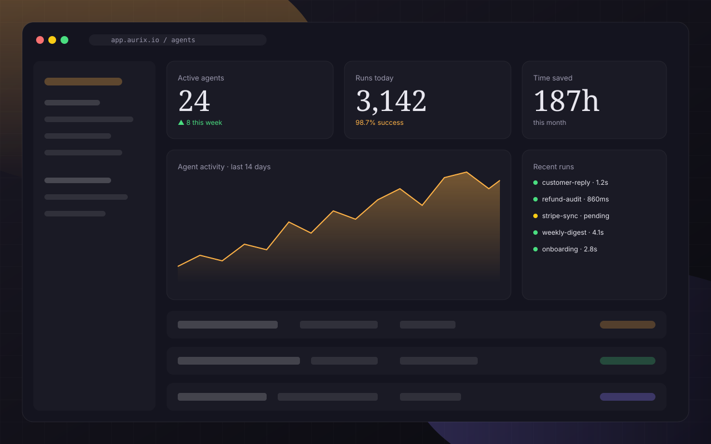

# Aurix — AI SaaS Landing Page Template

A single-page, dark-luxury HTML template for AI SaaS products.
Bento feature grid, editorial typography, gradient glow background,
terminal-style agent preview card, three-tier pricing, FAQ, and CTA.

## Quick start

Just open `index.html` in a browser. No build step required.

## Replace images

All visual assets live in `assets/img/`. Every `` tag in `index.html`
is preceded by a comment showing the expected dimensions, e.g.:

```html
<!-- REPLACE: product screenshot · 1280×800 · WebP/JPG -->

```

Placeholder files are polished SVGs so the template looks intentional
out of the box, but you should swap them with your real screenshots
or photography before shipping.

| File | Purpose | Recommended size |
|---|---|---|
| `hero-product.svg` | Hero dashboard mockup | 1280×800 |
| `feature-context.svg` | Bento feature screenshot | 960×540 |
| `avatar-1.svg` · `avatar-2.svg` · `avatar-3.svg` | Testimonial headshots | 160×160 square |

## Change colors

All design tokens are defined as CSS custom properties at the top of
`assets/css/styles.css`:

```css
:root {
  --bg: #0a0a0f;
  --text: #e8e7ef;
  --accent: #ffb347;
  /* ... */
}
```

## Tech

- Vanilla HTML + CSS + JS (no framework, no build)
- Google Fonts: Instrument Serif + Inter
- Responsive: 320 / 768 / 1024 / 1440+
- Accessibility: semantic landmarks, keyboard-focus styles, reduced-motion support

## License

Free for personal and commercial use. See html.design license page for details.
